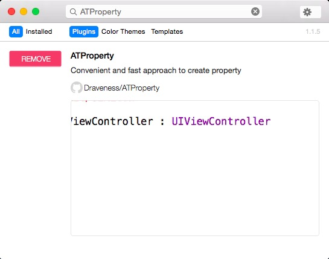
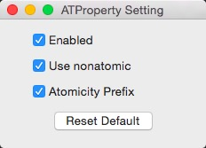

# ATProperty [](https://travis-ci.org/Draveness/ATProperty)

## What is this?

This is a convenient and fast approach to create property. You do not need to type `@property` and `nonatomic` when you declare a property.

You just needs to type `@s` like this.


## How to install?

The best way to install this is use [Alcatraz](http://alcatraz.io/). Install Alcatraz followed by the instruction, restart your Xcode. You can find `ATProperty` in the list. Just click the install button.



You can also clone the repo and build the target. And the plug-in will automatically be installed in `~/Library/Application Support/Developer/Shared/Xcode/Plug-ins`. Relaunch Xcode, and you can use this to create property.

## Usage

This plug-in is extremely easy to use.

### Common

| typein   | result |
| :------- |:-----------------------------|
|@s        | @property (nonatomic, strong) |
|@w        | @property (nonatomic, weak)   |
|@c        | @property (nonatomic, copy)   |
|@a        | @property (nonatomic, assign) |

### Readonly

| typein   | result |
| :------- |:-----------------------------|
|@rs        | @property (nonatomic, strong, readonly) |
|@rw        | @property (nonatomic, weak, readonly)   |
|@rc        | @property (nonatomic, copy, readonly)   |
|@ra        | @property (nonatomic, assign, readonly) |

### Readwrite

| typein   | result |
| :------- |:-----------------------------|
|@xs        | @property (nonatomic, strong, readwrite) |
|@xw        | @property (nonatomic, weak, readwrite)   |
|@xc        | @property (nonatomic, copy, readwrite)   |
|@xa        | @property (nonatomic, assign, readwrite) |

## Customize

You can customize the `ATProperty` plugin in menu:

```
Edit => ATProperty
```



You can disabled it by clicking the checkbox ahead `Enabled` label. Changing default atomicity to atomic or modifier symbol order are also allowed.

----

# Contribute

Feel free to open an issue or pull request, if you need help or there is a bug.

# Contact

- Powered by [Draveness](http://github.com/draveness)

# License

ATProperty is available under the MIT license. See the LICENSE file for more info.
